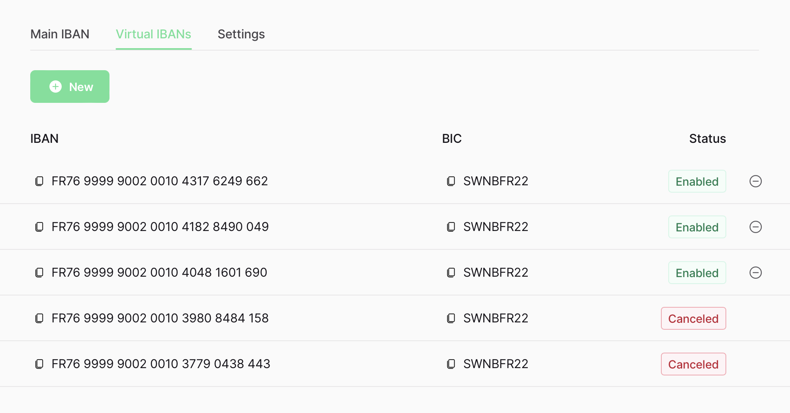

# Account

## Main IBAN

### Details

- IBAN (copyable)
- BIC (copyable)
- Account holder (`name`)

### Address

- Address (line 1)
- City
- Zip code
- Country

## Virtual IBANs

### "New" button

Should call the `addVirtualIbanEntry` mutation.

## Settings

### Details

Should use the `updateAccount` mutation:

- Name field (`name`)
- Official document language field (`language`)

**Only if** `accountHolder` is a company:

Should use the `updateAccountHolder` mutation

- VAT Number field (`vatNumber`)

### Contracts

- Swan's terms and conditions (generate URL given `accountCountry` and current locale)
