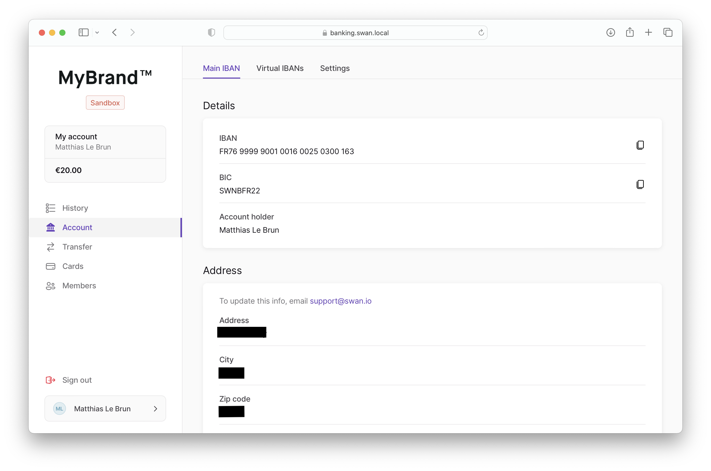
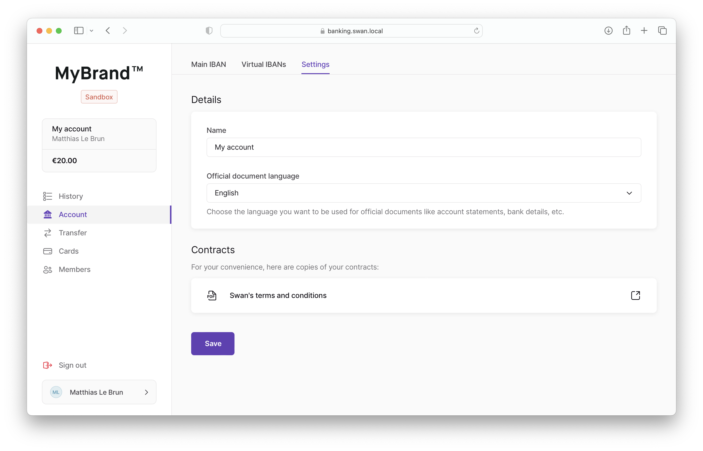

# Account

Along with the main navigation, the **account page** should include the following tabs:

- **Main IBAN tab**: each account has a single, main IBAN
- **Virtual IBAN tab**: accounts can have zero, one, several virtual IBANs
- **Settings tab**: access or change account name, language, and documents

## Main IBAN

The body of the **main IBAN tab** should include the following content:

- Details
  - IBAN (click to copy)
  - BIC (click to copy)
  - Account holder (`name`)
- Address
  - Address
  - City
  - Zip code
  - Country

## Virtual IBANs

The body of the **virtual IBANs tab** should include the following content:

- **Add new** button
- List of virtual IBANs
  - IBAN (click to copy)
  - BIC (click to copy)
  - Status
  - **Cancel** button for enabled virtual IBANs

### Add a new virtual IBAN

Adding a new virtual IBAN calls the `addVirtualIbanEntry` mutation.
The function works instantly, so no other front displays are needed; the new virtual IBAN appears on the list as soon as it's available.

### Cancel a virtual IBAN

Users should be able to cancel enabled virtual IBANs anytime.

It's not quite the same as deleting an IBAN, which isn't possible, but the end-user function is the same: when a user cancels a virtual IBAN, it won't be available to send or receive payments.

## Settings

The body of the **settings tab** should include the following content:

- Details (uses the `updateAccount` mutation)
  - Name field (`name`)
  - Official document language field with dropdown to choose language (`language`)
- Contracts
  - Swan's terms and conditions with the option to open in a new window (generate the URL based on the `accountCountry` and current location)

:::info For companies only
If the `accountHolder` is a **company**, add a field for the `vatNumber` that uses the `updateAccountHolder` mutation.
:::

