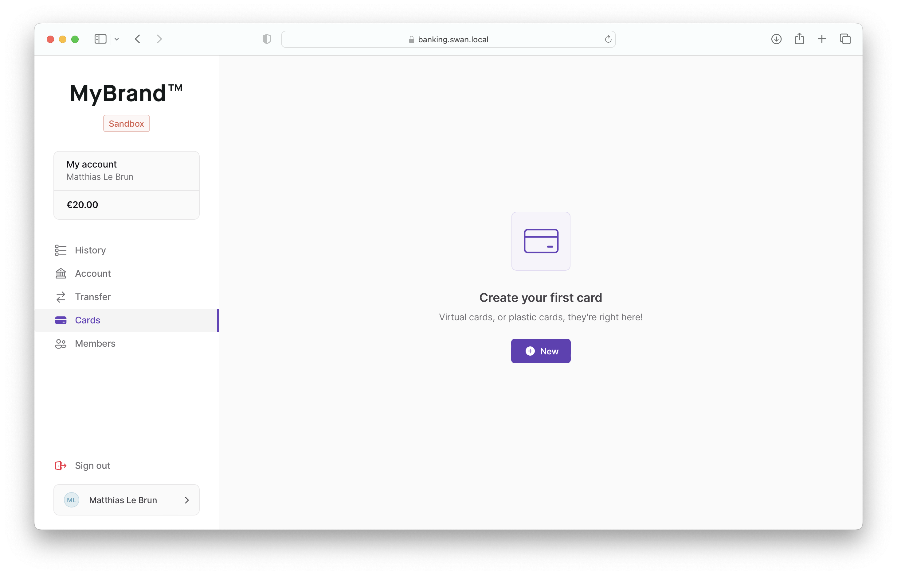
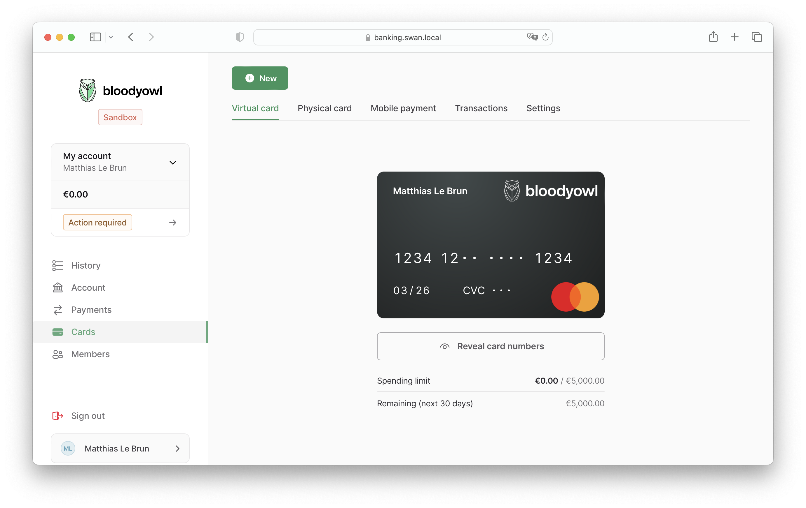
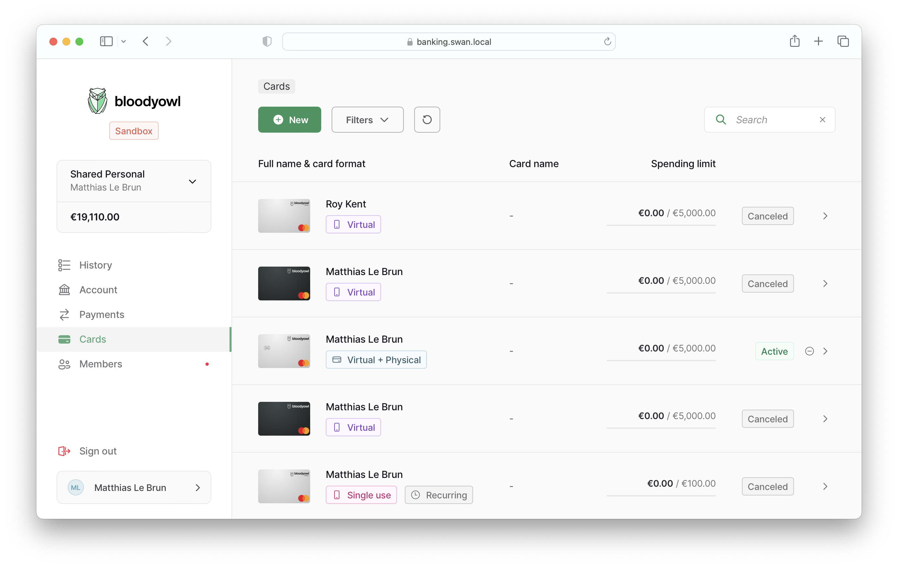

# Cards

## Query

The cards section can be presented in different ways given the user's account membership.

### With access to account

If the user can access the account (`canViewAccount`: `true`), get all the account cards using the root `cards` query field, with an `accountId` filter:

```graphql
query {
  cards(filters: {accountId: $currentAccountId}) {
    # ....
  }
}
```

### Without access to account

If the user can **not** access the account (`canViewAccount`: `false`), get the cards attached to their membership:

```graphql
query {
  accountMembership(id: $currentAccountMembershipId) {
    cards {
      # ...
    }
  }
}
```

## Listing

### No cards

If the query returns no cards, show a message with an "Add card" link.



### Single card

If the query returns a single card, show the card detail directly (with no breadcrumbs).



### Multiple cards

If the query returns multiple cards, show the card listing.


