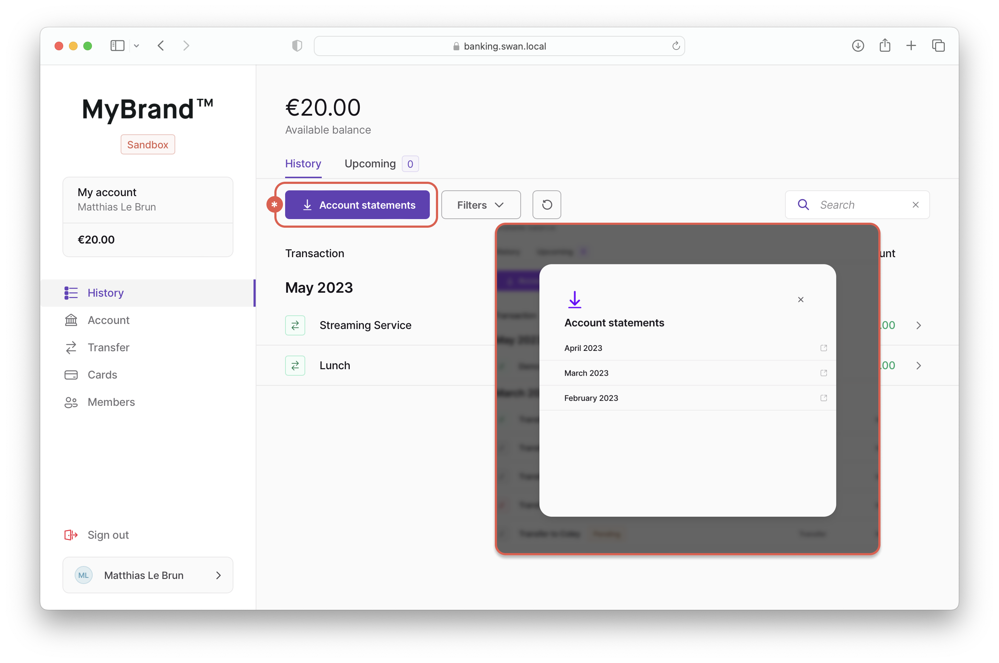
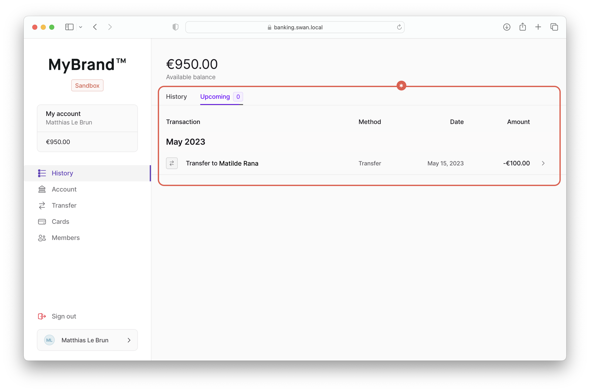

# History

Along with the main navigation, the **history page** should include the following content:

- Available **account balance**
- **History tab**: list of past transactions
- **Upcoming tab**: list of upcoming transactions


## History tab

The body of the history tab should include the following content:

- List of past transactions
  - Name of the transaction
  - Transaction method (such as instant or recurring transfer)
  - Date
  - Amount
- Button to download account statements
- Filters
  - Updated after
  - Updated before
  - Payment method
  - Status
- Refresh button (refreshes the list of transactions)
- Search (only searches transactions)

:::info History tab statuses
The history tab shouldn't display transactions with the status `Released` or `Upcoming`.
These are card authorizations, not actual transactions, and are irrelevant for the end user.
:::


### GraphQL query

Use the following GraphQL query to retrieve information about the transaction history.

<details>
<summary>GraphQL query</summary>

```graphql
query {
  account(accountId: $ACCOUNT_ID) {
    transactions(first: $first, after: $after, filters: $filters, orderBy: $orderBy) {
      pageInfo {
        hasNextPage
        endCursor
        startCursor
        hasPreviousPage
      }
      edges {
        node {
          ...TransactionDetails
        }
      }
    }
  }
}
```

</details>

### Account statements

Always provide a method for users to **download their transaction history**.

The source code provides this with button in the history tab.
When a user clicks **Account statements**, a pop-in appears with a list of months for which downloadable account statements are available.



## Upcoming tab

The body of the upcoming tab should include the following content:

- List of upcoming transactions
  - Name of the transaction
  - Transaction method (such as instant or recurring)
  - Date
  - Amount

:::info Upcoming tab statuses
The upcoming tab should **only** display transactions with the status `Upcoming`.
It is recommended not to provide filters.
:::



### GraphQL query

Use the following GraphQL query to retrieve information about upcoming transactions.

<details>
<summary>GraphQL Query</summary>

```graphql
query {
  account(accountId: $ACCOUNT_ID) {
    transactions(
      first: $first
      after: $after
      filters: { status: Upcoming }
      orderBy: { field: executionDate, direction: Asc }
    ) {
      pageInfo {
        hasNextPage
        endCursor
        startCursor
        hasPreviousPage
      }
      edges {
        node {
          ...TransactionDetails
        }
      }
    }
  }
}
```

</details>