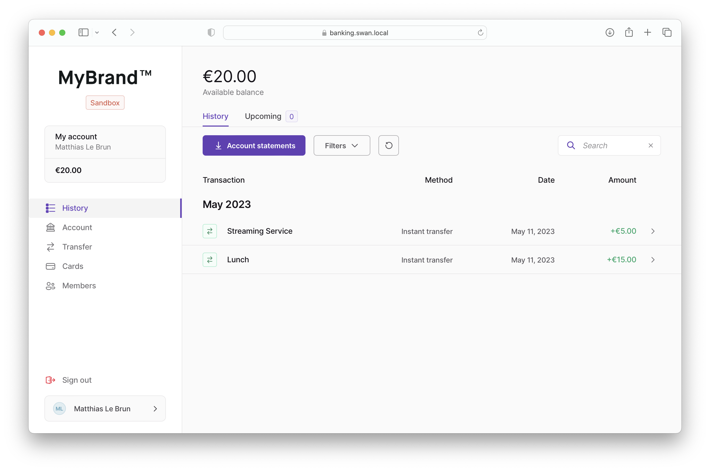
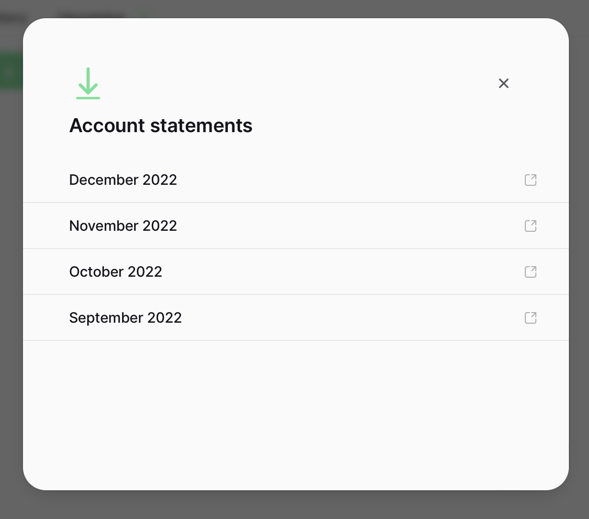

# History

> The History section

## Layout



The layout should show:

- the **account’s available balance if acce**

Two tabs:

- **History**: a list of past transactions
- **Upcoming**: a list of, _you guessed it_, upcoming transactions

## History

[Transaction List](./transaction-list)

<details>
<summary>GraphQL Query</summary>

```graphql
query {
  account(accountId: $accountId) {
    transactions(first: $first, after: $after, filters: $filters, orderBy: $orderBy) {
      pageInfo {
        hasNextPage
        endCursor
        startCursor
        hasPreviousPage
      }
      edges {
        node {
          ...TransactionDetails
        }
      }
    }
  }
}
```

</details>

:::caution
The History **must not** allow seing `Released` or `Upcoming` transactions. These transactions are card authorizations that only is noise to users.
:::

In the filters, show a primary button to open the **[Account Statements](#account-statements)** modal.

## Upcoming

<details>
<summary>GraphQL Query</summary>

```graphql
query {
  account(accountId: $accountId) {
    transactions(
      first: $first
      after: $after
      filters: { status: Upcoming }
      orderBy: { field: executionDate, direction: Asc }
    ) {
      pageInfo {
        hasNextPage
        endCursor
        startCursor
        hasPreviousPage
      }
      edges {
        node {
          ...TransactionDetails
        }
      }
    }
  }
}
```

</details>

:::info
Only show transactions with an `Upcoming` status and **don’t** show filters.
:::

## Account statements


