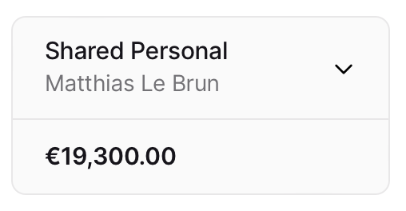
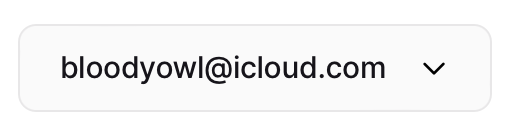
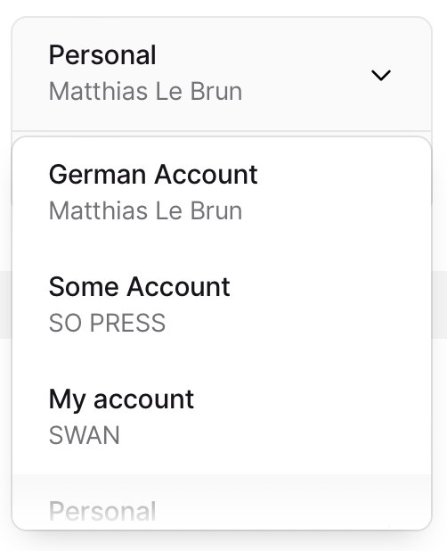
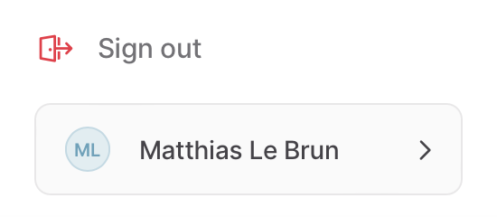

# Navigation

## Account Membership

An **Account Membership** represents the link between a **User** and an **Account**.

We can query the **Account Memberships** to see what accounts the user can access.

:::info
A user can have an account membership to an account **without any permissions** (sort of a _blind membership_). In this case the user won’t be able to access the `account` information (not even its ID). The usual use-case for this setup is to order cards for users and only let them access this section.
:::

## Web Banking settings

The project holds some **feature flags** for the Web Banking to make the no-code experience more flexible. Note that they’re only frontend flags, and don’t prevent these actions API-wise.

- **canAddNewMembers**: toggles the “New” button in the Members section
- **canViewMembers**: toggles the Members section
- **canViewAccountDetails**: toggles the Account section
- **canViewAccountStatement**: toggles the “Account Statements” button in the History section
- **canOrderVirtualCards**: toggles the “Add Card” button on the Cards & Members section
- **canOrderPhysicalCards**: filters the offered card products in the Card setup
- **canInitiatePaymentsToNewBeneficiaries**: toggles the “New” button in the Transfers section
- **canViewPaymentList**: toggles the Transfers section
- **canManageVirtualIbans**: toggles the “New” button in the Virtual IBANs section

```graphql
fragment WebBanking on ProjectInfo {
  webBankingSettings {
    canAddNewMembers
    canViewMembers
    canViewAccountDetails
    canViewAccountStatement
    canOrderVirtualCards
    canOrderPhysicalCards
    canInitiatePaymentsToNewBeneficiaries
    canViewPaymentList
    canManageVirtualIbans
  }
}
```

# Account Membership picker

> The picker and summary for the membership you’re using.

### Membership picker

Show the currently selected account membership.

:::info
`canViewAccount`: `false` restricts access to the `account` property in the membership.
:::

If the membership has the `canViewAccount` permission:

- `membership.account.name`
- `membership.account.holder.name`



Otherwise:

- `membership.email`



When open, the picker should list the current user's account memberships.



### Account balance

If the membership has the `canViewAccount`:

- Show `account.balance.available`

### Account activation notification

- If user’s `identificationStatus` is `Processing`, show `Pending`
- If user’s `identificationStatus` is **different** from `ValidIdentity`, show `Action Required`
- If any of the account holder’s `supportingDocumentCollections` has a `documentCollectionStatus` different from `Approved` and `PendingReview`, show `Action Required`
- If any of the account holder’s `supportingDocumentCollections` has a `documentCollectionStatus` with `PendingReview`, show `Pending`
- If the account holder is an `Individual` and the account `transactions` total count is 0, show `Action Required`


# Inner account membership navigation

> The navigation for the currently selected account membership

### History

Show if `membership.canViewAccount`

### Account

Show if `membership.canViewAccount`

### Payments

Show if **all match**:

- either `webBankingSettings.canInitiatePaymentsToNewBeneficiaries` or `webBankingSettings.canViewPaymentList`
- `membership.canInitiatePayments`
- `membership.statusInfo.status` is `Enabled`

### Cards

Show if **either match**:

1. `membership.canManageMembership` and `webBankingSettings.canOrderVirtualCards`
2. `membership.cards.totalCount` > 0

:::info
The second case is to **let users manage their card** even though they don’t have any permission
:::

### Members

Show if **all match**:

- `webBankingSettings.canViewMembers`
- `membership.canManageMembership`

Show the red pill if the account has at least one membership with the `BindingUserErrorStatus`

## User section



### Sign out

Show a sign out link

### Current user

Show the current user:

- Avatar
- First & last name

If the user’s `identificationStatus` is `Uninitiated`, `InsufficientDocumentQuality`, `InvalidIdentity` or `ReadyToSign`, show a an “Action Required” tag [if the project and membership require](./identity-verification-bypass).
