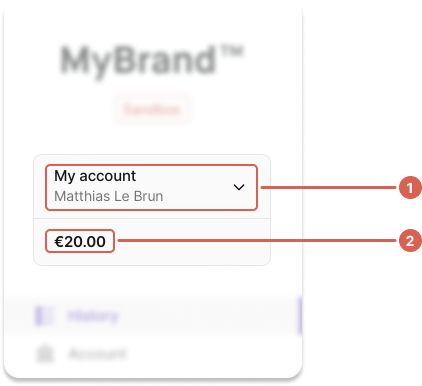
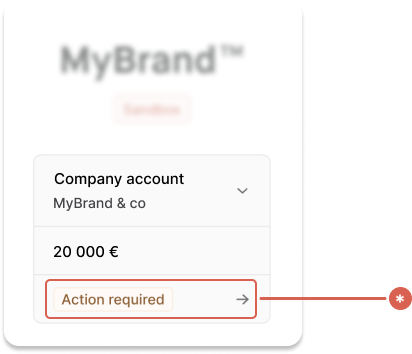
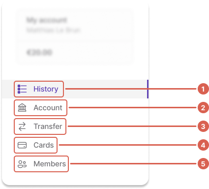
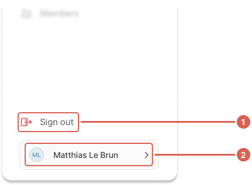

# Navigation

The primary navigation for the web banking app consists of four main sections:

1. Partner **logo** and **environment** type.
1. **Account information**, including account name, user name or email address, and balance.
1. **Application pages**, namely _History_, _Account_, _Transfer_, _Cards_, and _Members_.
1. Option to **sign out** and view your own **user profile**.


:::info Permissions-based navigation
The elements displayed depend on the user's account membership and permissions, explained in detail in this documentation.
:::

## Section 1: Logo and environment


## Section 2: Account information

The **account information** section includes (1) the account name and user name, and (2) the account balance.
Alternatively, only the email address might be displayed.



All are retrieved with the API, though visibility is determined by account membership permissions (an _account membership_ is what binds a user to an account).
For any user, query **account memberships** to see which accounts they can access.

**Display the currently-selected account membership**.
When multiple account memberships are available, they should be accessible with a dropdown.

Based on `canViewAccount` permissions, display the following:

| `canViewAccount`                                                                 | Display                                                                                                                                                                    |
| -------------------------------------------------------------------------------- | -------------------------------------------------------------------------------------------------------------------------------------------------------------------------- |
| **`true`**                                                                       | <ul><li>`membership.account.name` (example: My account)</li><li>`membership.account.holder.name` (example: Matthias Le Brun)</li><li>`account.balance.available`</li></ul> |
| **`false`**<br />(restricts access to the account membership property `account`) | <ul><li>`membership.email` (example: m.lebrun[@]mybrand.com)</li></ul>                                                                                                     |

:::note Account member with no permissions
A user can be an account member **without any permissions**, even the permission to view the account.
This account member won’t be able to access any account information, including the account ID.
:::

### Status tags

The account information section can also be used to share details about the user's `identifications`, `documentCollectionStatus`, and `transactions`.



We get the last relevant identification (the one matching the `recommendedIdentificationLevel` on the account membership).

| Status                                                                | Explanation                                                                                  | Tag                 |
| --------------------------------------------------------------------- | -------------------------------------------------------------------------------------------- | ------------------- |
| **`identification`** is `Pending`                                     | Identification verification is still processing                                              | **Pending**         |
| **`identification`** is _not_ `Valid` or `Pending`                    | Identification verification is at any stage of processing, but not completed                 | **Action Required** |
| **`documentCollectionStatus`** is _not_ `Approved` or `PendingReview` | If **any** account holder has missing or invalid documents (`supportingDocumentCollections`) | **Action Required** |
| **`documentCollectionStatus`** is `PendingReview`                     | If **any** account holder has documents being reviewed (`supportingDocumentCollections`)     | **Pending**         |
| **`transactions`** total is `0`                                       | For `individual` account holders only                                                        | **Action Required** |

## Section 3: Application pages

Pages are visible based on account membership permissions.



| Page         | Rules                                                                                                                                                                                                                                                                                                 |
| ------------ | ----------------------------------------------------------------------------------------------------------------------------------------------------------------------------------------------------------------------------------------------------------------------------------------------------- |
| History (1)  | Visible if `membership.canViewAccount` is `true`                                                                                                                                                                                                                                                      |
| Account (2)  | Visible if `membership.canViewAccount` is `true`                                                                                                                                                                                                                                                      |
| Payments (3) | Visible if **all match**: <br /><ul><li>either `webBankingSettings.canInitiatePaymentsToNewBeneficiaries` or `webBankingSettings.canViewPaymentList` is `true`</li><li>`membership.canInitiatePayments` is `true`</li><li>`membership.statusInfo.status` is `Enabled`</li></ul>                       |
| Cards (4)    | Visible if **either match**: <br /><ul><li>`membership.canManageMembership` and `webBankingSettings.canOrderVirtualCards` is `true`</li><li>`membership.cards.totalCount` > 0 (allows users to manage their cards, even without the permissions)</li></ul>                                            |
| Members (5)  | Visible if **all match**: <br /><ul><li>`webBankingSettings.canViewMembers` is `true`</li><li>`membership.canManageMembership` is `true`</li></ul><br />Display a notification alert (often a small, red circle) if the account has at least one membership with the status `BindingUserErrorStatus`. |

## Section 4: Sign out and profile

Provide a link to **sign out**, plus the **user's information** (avatar and first and last name).



## Visibility and feature flags

Because this project contains the same code Swan uses for all frontend and no-code instances, feature flags are often introduced.
Feature flags make the frontend no-code experience more flexible and have **no impact on the API**.

- `canAddNewMembers`: toggles the **New** button on the Members page
- `canViewMembers`: toggles the Members page
- `canViewAccountDetails`: toggles the Account page
- `canViewAccountStatement`: toggles the “Account statements” button on the History page
- `canOrderVirtualCards`: toggles the “Add card” button on the Cards & Members pages
- `canOrderPhysicalCards`: filters the offered card products on the Cards page
- `canInitiatePaymentsToNewBeneficiaries`: toggles the **New** button on the Transfers page
- `canViewPaymentList`: toggles the Transfers page
- `canManageVirtualIbans`: toggles the **New** button in the Virtual IBANs page

Retrieve information about current feature flags with the API:

```graphql
fragment WebBanking on ProjectInfo {
  webBankingSettings {
    canAddNewMembers
    canViewMembers
    canViewAccountDetails
    canViewAccountStatement
    canOrderVirtualCards
    canOrderPhysicalCards
    canInitiatePaymentsToNewBeneficiaries
    canViewPaymentList
    canManageVirtualIbans
  }
}
```
