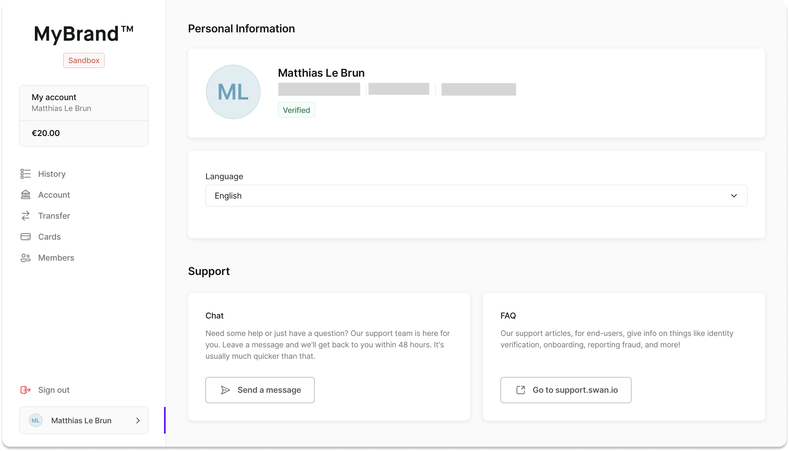

# Profile

Along with the main navigation, the **user profile** should include the following content:

- User's first and last name
- Email address (connected to account memberships)
- Phone number
- User creation date
- Identification status
- Language preference

Additionally, there should be links to various user resources, whether to your own or to [Swan Customer Support](https://support.swan.io/hc).

:::info Default language
By default, the language matches the `navigation.languages` value of the user's web browser.
If the user overrides this default, the override is stored in the client’s local storage.
:::

:::note Identification statuses

Some identification statuses trigger verification events.

| Status | Note |
| -- | -- |
| `Uninitiated`, `InsufficientDocumentQuality`, `InvalidIdentity` | User is presented an OAuth2 link; when clicked, it triggers an identity verification flow using the current membership’s `recommendedIdentificationLevel`. |
| `ReadyToSign` (unique to `QES`) | User is presented an OAuth2 link; when clicked, it triggers an identity verification flow with `QES`, prompting the user to finish their verification. |

Refer to the page on OAuth2 for more information about [identification levels](../../oauth2.md).
:::