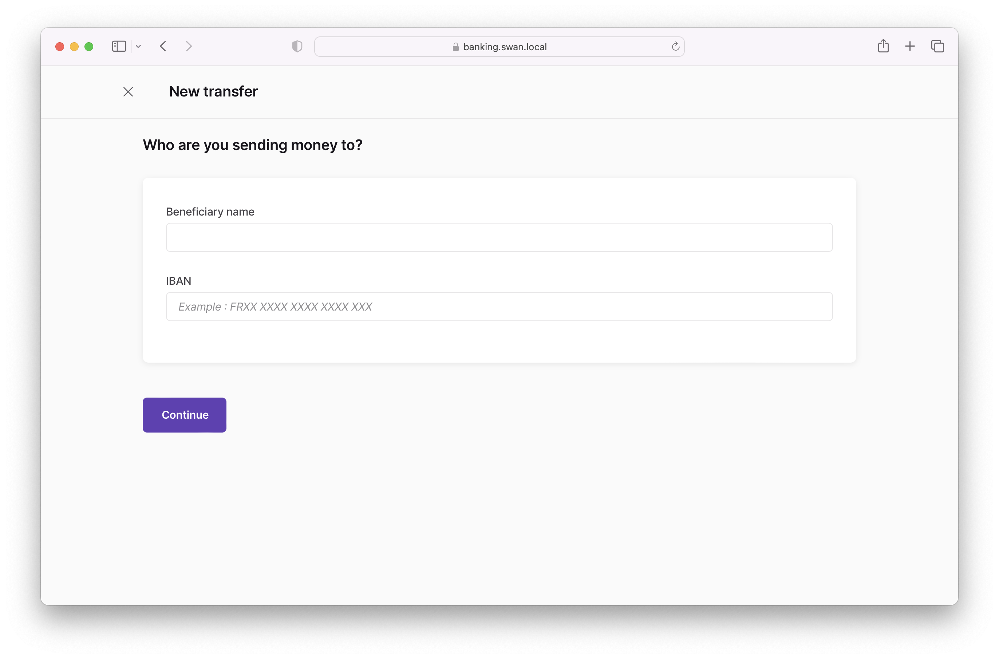

# Transfer

Along with the main navigation, the **transfer page** should include the following content:

- **Send transfer** call to action
- **Schedule recurring transfer** call to action
- List of **active recurring transfers** with option to filter for canceled recurring transfers
    - Recipient
    - Short explanation
    - Recurrence
    - Next execution
    - Amount
    - Actions (notably, a **cancel** button)

## New transfer

When sending a new transfer, the following information should be collected from the user:

- Recipient name
- Recipient IBAN
- Reason (short explanation, reference number—whatever is needed for your use case)
- Transfer amount
- Schedule (*standard* by default; can also choose *instant*)

After the user clicks **Confirm** to send their transfer, redirect them to your consent URL.

:::info Instant transfers with fallback
For instant transfers, consider using `InstantWithFallback` mode.
If instant transfers aren't available for any reason, the transfer will continue as a standard transfer.
This saves the user from needing to send a different transaction.
Learn more about [transfer modes](https://docs.swan.io/concept/payment/instant-credit-transfer#fallback-to-standard-transfer) in our main documentation.
:::

## New recurring transfer

When sending a new recurring transfer, the following information should be collected from the user:

- Recipient name
- Recipient IBAN
- Reason (short explanation, reference number—whatever is needed for your use case)
- Transfer type (*specified amount* or *full balance*) and amount
    - For *full balance transfers*, the user indicates how much should be left in the account. Everything else is transferred.
- Schedule (*daily*, *weekly*, or *monthly*)

After the user clicks **Confirm** to send their transfer, redirect them to your consent URL.

