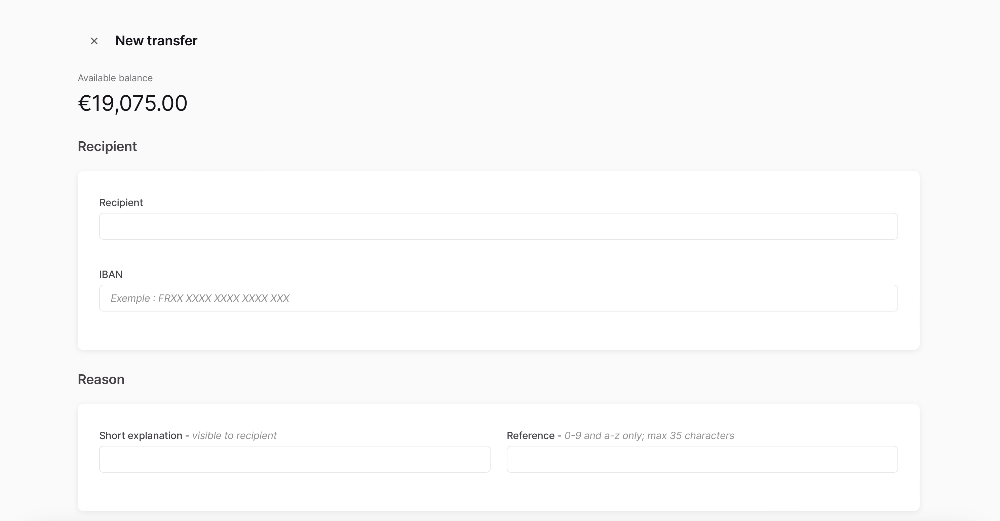

# Transfer

## Listing

The page should show two call to actions:

- New Transfer
- New Recurring Transfer

Below the actions, a list of the currently active recurring transfers should be shown.

## New Transfer

:::info
We recommend to use the `InstantWithFallback` mode in case the `Instant` option is selected in order to automatically fallback to a regular transfer if instant isn't available.
:::

At the end, redirect to the provided consent URL.

## New Recurring Transfer

At the end, redirect to the provided consent URL.
