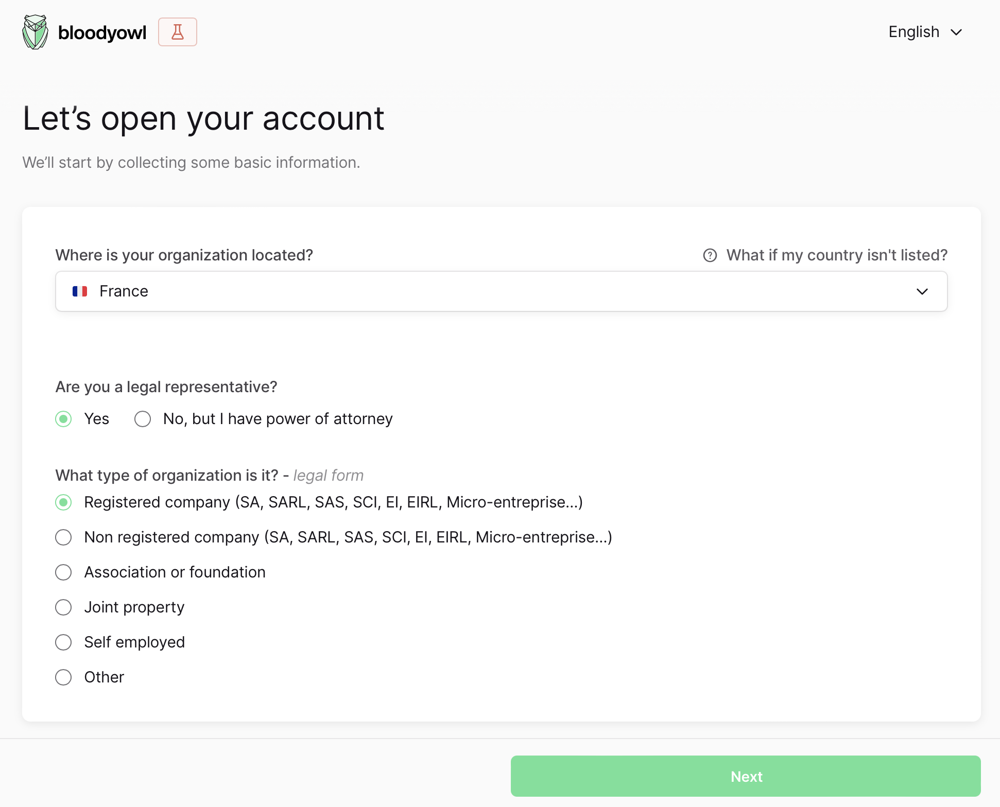
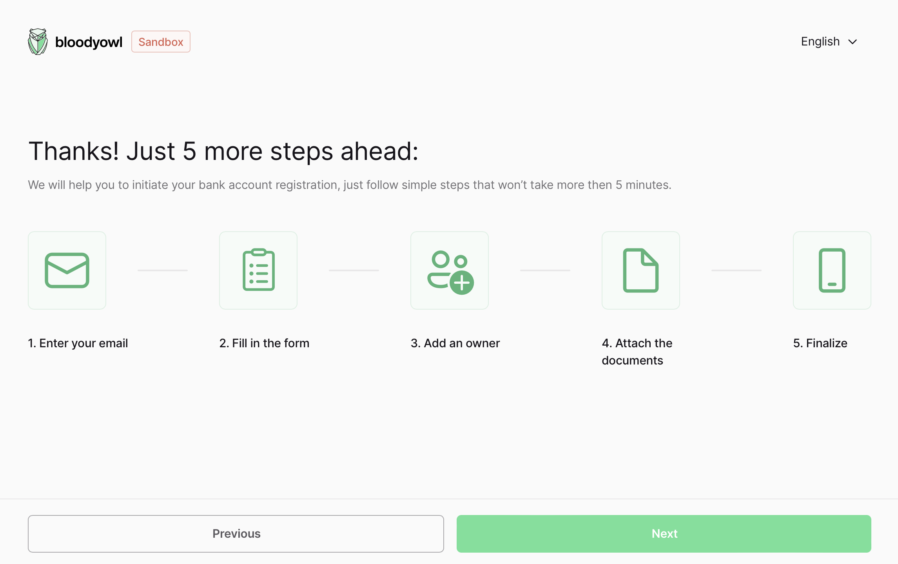
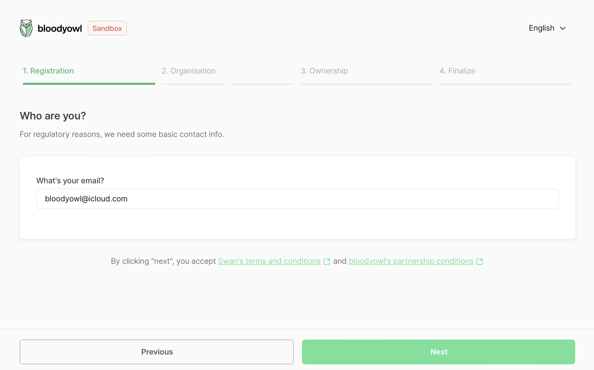
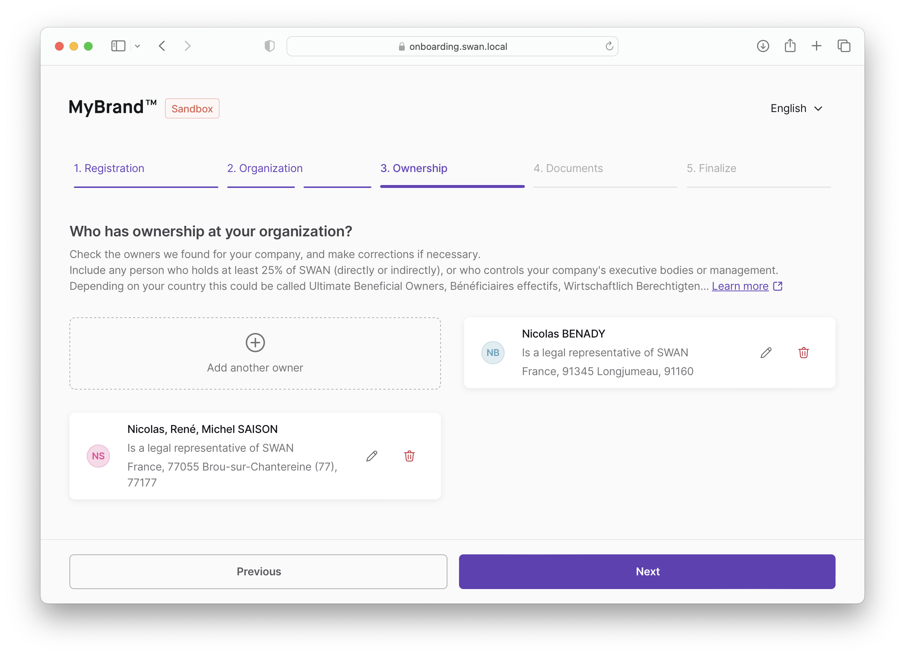
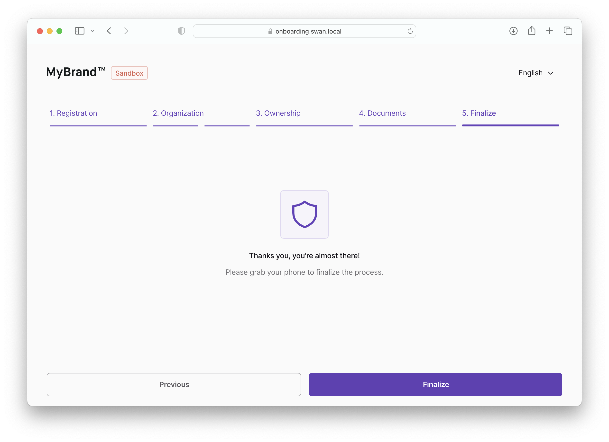

# Company Onboarding

On each step, clicking on **Next** should update the onboarding in the API. This helps resuming the onboarding after a page reload.

# First information

The first screen asks for basic information that condition the rest of the flow:

- The organization (company, association …) country
- How the user represents the organization (wether being a **legal representative**, or **someone with a power of attorney**, in which case we’ll require the document)
- The type of organization (this conditions the types of documents we’ll ask)

# Summary screen

The second screen shows a summary of the steps to come.

- **Email**: mandatory
- **Fill in the form**: mandatory
- **Add an owner**: if the organization is a company, home owner association or “other”.
- **Attach the documents**: if the onboarding’s supporting document collection’s `requiredSupportingDocumentPurposes` is not empty
- **Finalize**: mandatory

# Form

The form should show a stepper on top, showing the user progress in the onboarding flow.

## 1. Registration

The user must fill their **email address**.

:::info 🇩🇪 German Account
For German accounts, two mandatory fields are added: **legal representative** **country of residence** and **address**.
:::

## 2. Organization

### 2. a. Legal information & Organization address

**Legal information**

The following fields are displayed:

- **organization name** (mandatory)
- **organization registration number** (optional)
- **organization VAT number** (optional)

:::info 🇩🇪 German Account
For **German accounts** when onboarding a **German company**, the user is presented an optional **tax identification number** field (10 or 11 characters, numbers only)
:::

**Organization address**

The user must fill their organization address.

### 2. b. Company details

The user must fill the following fields:

- **Business activity**
- **Business description**
- **Expected monthly payment throughput**

## 3. Ownership

:::caution
This step is only applicable if the organization is a **company**, **home owner association** or **“other”**
:::

:::info
The ultimate beneficiary owners are fetched automatically on onboarding update if the information is available, as soon as the necessary information (like the registration number) are gathered, **in most cases, this should not require any filling from the user**!
:::

On this step, the user can add the organization’s ultimate beneficiary owners.

When adding or editing an owner, a modal should appear with the following fields:

- **First name** (mandatory)
- **Last name** (mandatory)
- **Birth date** (mandatory)
- **Birth country** (mandatory)
- **Birth city** (mandatory)
- **Birth postal code** (mandatory)
- **Type of control exercised** (mandatory)
  - if “Ownership of capital”, add:
    - **Total percentage of capital held** (number, mandatory)
    - two checkboxes:
      - **Directly**
      - **Indirectly**

:::info 🇩🇪 German Account
For German accounts, the form should contain a second step with the following fields:

- **Residency country**
- **Residency address**
- **Tax identification number** (optional), only show if the owner’s residency country is Germany

:::

## 4. Finalize

This step just informs the user of the authentication flow to come.

Clicking on **Finalize** checks for potential errors in the onboarding using `statusInfo`, if there’s none, it redirects to the OAuth2 server to log or enroll the user through the consent app.

The OAuth2 link must have the following query parameters:

- `identificationLevel`: containing the value provided by the onboarding’s `legalRepresentativeRecommendedIdentificationLevel` to make sure the account is compliant with its country regulations
- `onboardingId`: to link the user to the created account
- `projectId`

:::caution
For security & privacy reasons, once the onboarding is finalized, **it’s no longer accessible through the unauthenticated API**.
:::
