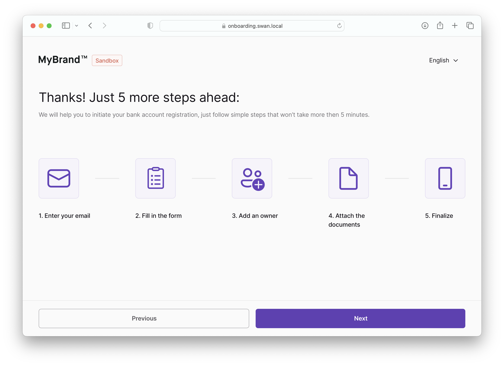
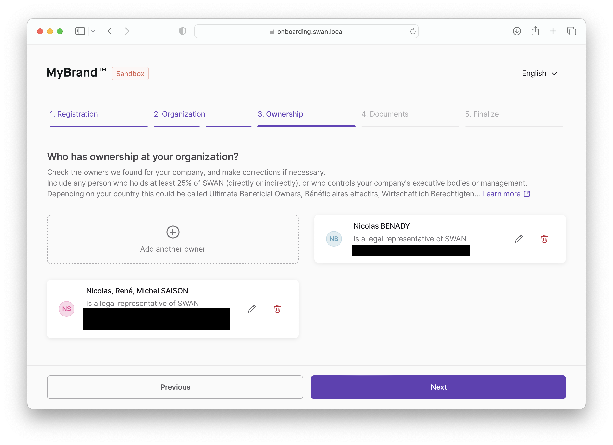

import PartialExample from "./_finalize.mdx";

# Company onboarding

Use the company onboarding process when you're setting up Swan for an entire company.

When the user clicks **Next** after each step, the onboarding is updated in the API.
This helps resume onboarding after a page reloads.
 
## Preliminary information

The first screen asks for essential information that determines the rest of the flow.

1. Organization country (regardless of the type of organization).
1. Legal status of the person completeing onboarding.
    - Only **legal representatives** and those with **power of attorney** can complete onboarding for a company.
    - Those with power of attorney will be asked to provide documented proof later.
1. Type of organization (required documents change based on this response).

## Process overview

The second screen shows a **overview of the steps** to come.

- **Email**, **Fill in the form**, and **Finalize** are always required.
- If the organization is a company, home owner association, or other, **Add an owner** is required.
- If the required documents haven't been provided, meaning `requiredSupportingDocumentPurposes` is empty,  **Attach the documents** is required. 

:::info Stepper
The form should **include a stepper** on top, displaying the four steps and the user's progress as they complete their onboarding.
:::

## Step 1: Registration

The user must provide their **email address**.
Email addresses are used for communication only and are never shared externally.

By clicking **Next**, the user accepts two sets of terms and conditions: yours and Swan's.

:::caution 🇩🇪 Germany
For German accounts, you must add two fields to collect information about the legal representative:

- Country of residence
- Residence address
:::

## Step 2: Organization

Collect three pieces of information about the organization, separated on two screens.

- Screen 1: Legal information and organization address
- Screen 2: Company details

### Legal information and address

After confirming whether or not the organization is registered for Rich Communication Services (RCS), collect the following information:

- Organization name (mandatory)
- Organization registration number (optional)
- Organization VAT number (optional)

The user must also provide their organization address (not pictured).

:::caution 🇩🇪 Germany
For German companies with German accounts, collect the **company tax number** as well (*Umsatzsteuer-Identifikationsnummer*; 10 or 11 characters, numbers only).
:::

### Company details

The user must provide the following information:

1. **Business activity**: from the provided list, choose the activity that best corresponds.
1. **Business description**: describe the business; what does it do, what are it's goals, and so forth.
1. **Expected monthly payment**: choose the range that matches how much the company expects to receive monthly.

## Step 3: Ownership

Users need to add or verify the organization’s **ultimate beneficiary owners** (UBO).

If the UBO information is already available, it is fetched automatically.
Typically, a user will verify the information on this page instead of adding it themselves.

:::info organization type
The ownership step only applies if the user selected **company**, **association** (specifically *home owner association*), or **“other”** when submitting their preliminary information.
:::

To **add or edit an owner**, include a modal with the following fields (all mandatory):

- First or given name
- Last or family name
- Birth date
- Birth country
- Birth city
- Birth postal code
- Type of control exercised (*Legal representative*, *Ownership of capital*, or *Other*)
  - For *Ownership of capital* only, add the following:
    - Total percentage of capital held (number)
    - *Directly* and *Indirectly* checkboxes to indicate type of ownership

:::caution 🇩🇪 Germany
For German accounts, you need to **collect additional information about the UBO**.
We suggest creating a second page in the modal.

- **UBO residency country**
- **UBO residency address**
- If the owner’s residency country is Germany `DEU`, add:
  - **UBO tax identification number** (*Steuer-Identifikationsnummer*)

:::

## Step 4: Documents

Required documents change based on the country and the organization type selected when submitting preliminary information.

Refer to the list of [required Know Your Business (KYB) documents](https://docs.swan.io/regulatory/required-kyb-documents-for-company-accounts) in our main documentation.
Email us at support@swan.io for further assistance.

## Step 5: Finalize

<PartialExample />

:::info
For security reasons, an onboarding cannot be accessed by the unauthenticated API after it is finalized.
:::
