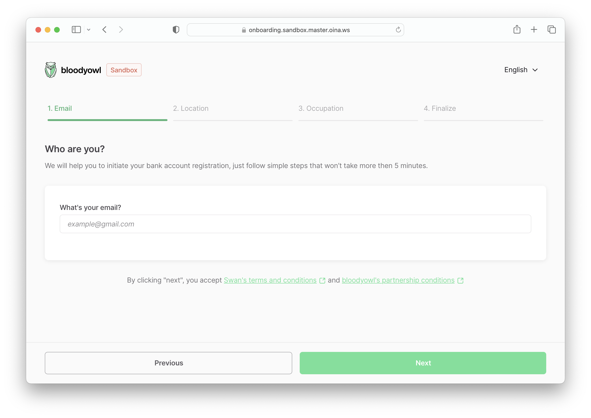
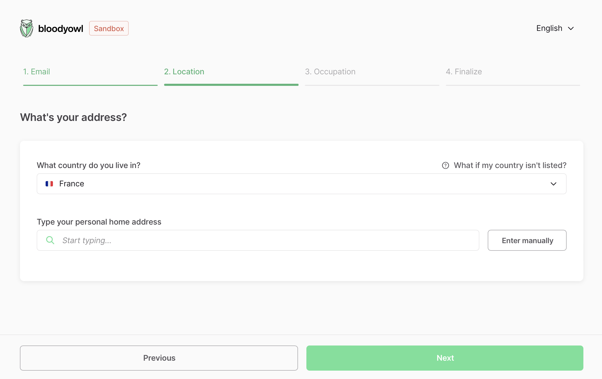
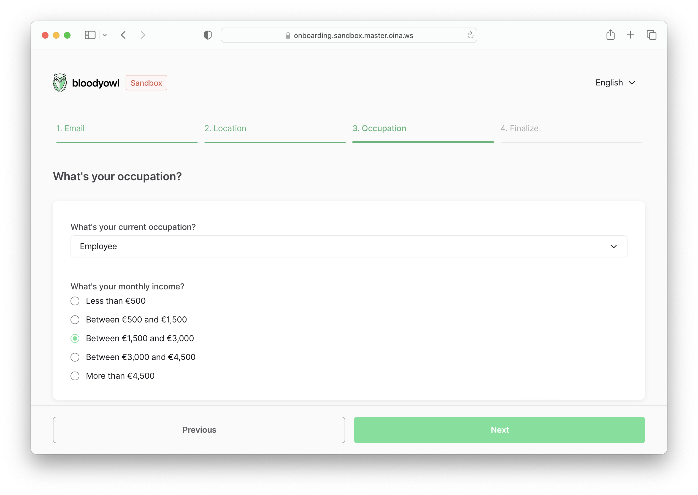
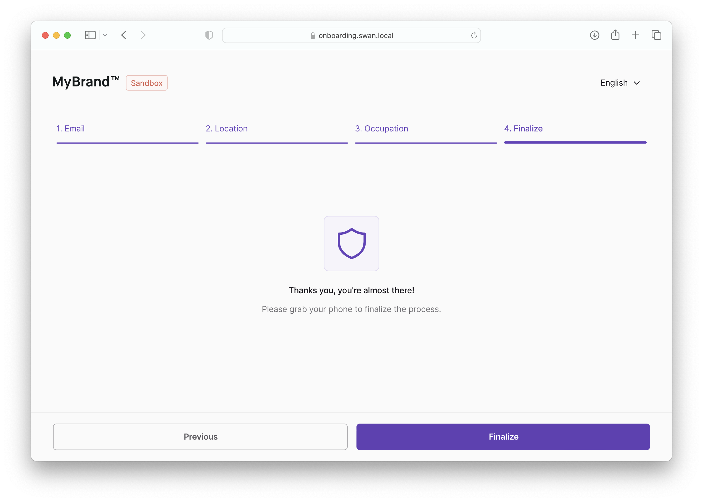

# Individual Onboarding

On each step, clicking on **Next** should update the onboarding in the API. This helps resuming the onboarding after a page reload.

# Summary screen

The first screen shows a summary of the steps to come.

# Form

The form should show a stepper on top, showing the user progress in the onboarding flow.

## 1. Email

The user must fill their **email address**.

## 2. Location

The user must fill their **residence country**, then their **residence address**.

:::info 🇩🇪 German Account
On a **German account**, if the user is a **German resident**, we’ll ask for their **tax identification number** (optional)
:::

## 3. Occupation

The user must fill their **occupation** & **monthly income**.

:::info
This step helps the KYC analysis.
:::

:::info 🇩🇪 German Account
If the onboarding `accountContry` is `DEU` and the user’s `residencyAddress` is `DEU`, an optional **tax identification number** field is presented (11 characters, numbers only).
:::

## 4. Finalize

This step just informs the user of the authentication flow to come.

Clicking on **Finalize** checks for potential errors in the onboarding using `statusInfo`, if there’s none, it redirects to the OAuth2 server to log or enroll the user through the consent app.

The OAuth2 link must have the following query parameters:

- `identificationLevel`: containing the value provided by the onboarding’s `legalRepresentativeRecommendedIdentificationLevel` to make sure the account is compliant with its country regulations
- `onboardingId`: to link the user to the created account
- `projectId`

:::caution
For security & privacy reasons, once the onboarding is finalized, **it’s no longer accessible through the unauthenticated API**.
:::
