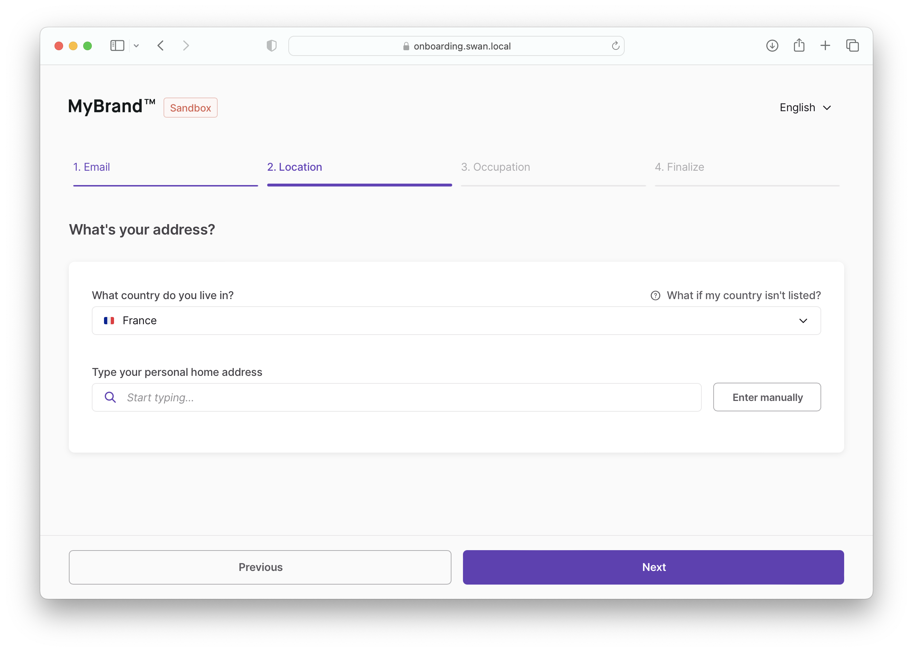

import PartialExample from "./_finalize.mdx";

# Individual onboarding

Use the individual onboarding process for users who are opening accounts for themselves.

## Process overview

The first screen shows a **overview of the steps** to come.

When the user clicks **Next** after each step, the onboarding is updated in the API.
This helps resume onboarding after a page reloads.

:::info Stepper
The form should **include a stepper** on top, displaying the four steps and the user's progress as they complete their onboarding.
:::

## Step 1: Email

The user must provide their **email address**.
Email addresses are used for communication only and are never shared externally.

By clicking **Next**, the user accepts two sets of terms and conditions: yours and Swan's.

## Step 2: Location

The user must provide their **country of residence** and their **residence address**.

:::caution 🇩🇪 Germany
For users residing in Germany opening accounts with a German IBAN, their **tax ID** (_Steuer-Identifikationsnummer_) is required.
:::

## Step 3: Occupation

The user must provide their **occupation** and the range of their **monthly income**.
This information is required for Swan to perform a Know Your Customer (KYC) analysis and is important to assess for potential fraud.

:::caution 🇩🇪 Germany
If the `accountContry` and `residencyAddress` are both Germany (`DEU`), an optional **tax ID** (Steuer-Identifikationsnummer) field is presented (11 characters, numbers only).
:::

## Step 4: Finalize

<PartialExample />

:::info
For security reasons, an onboarding cannot be accessed by the unauthenticated API after it is finalized.
:::
