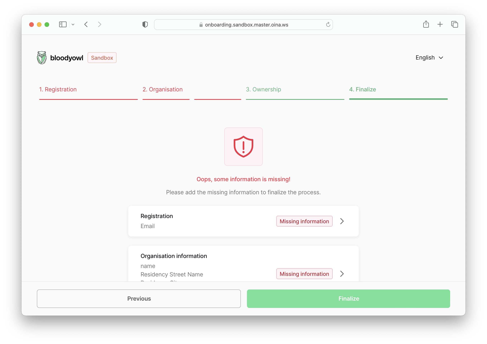

Onboarding is a big form that End Customers fill in order to **create their bank account**. It enables us to **collect the necessary informations and documents**.

The onboarding UI uses the **unauthenticated API**, and **requires an existing onboarding (we store the information behind its ID, as the user isn’t authenticated yet)**.

Once the onboarding is fetched, we can route to the correct flow given the `onboarding.info` typename.

## Types of flows

- [Individual onboarding](/specs/onboarding/individual)
- [Company onboarding](/specs/onboarding/company)

## Onboarding finalization

In order to avoid locking users when there are some discrepancies between client-side & server-side validation, we prevent finalizing an onboarding if its `statusInfo` is invalid.

